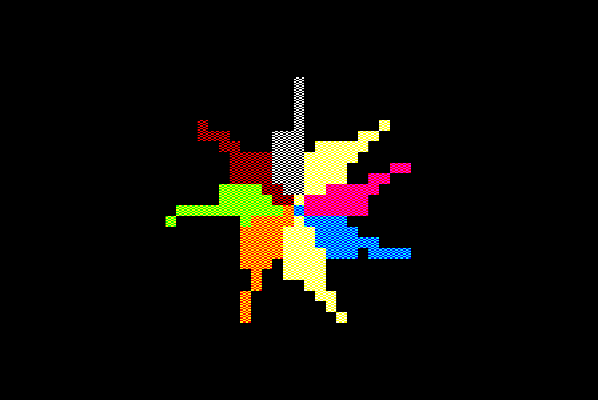
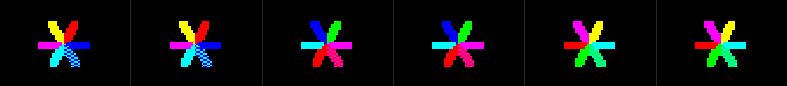
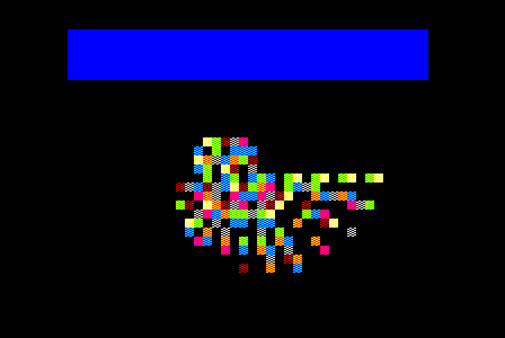
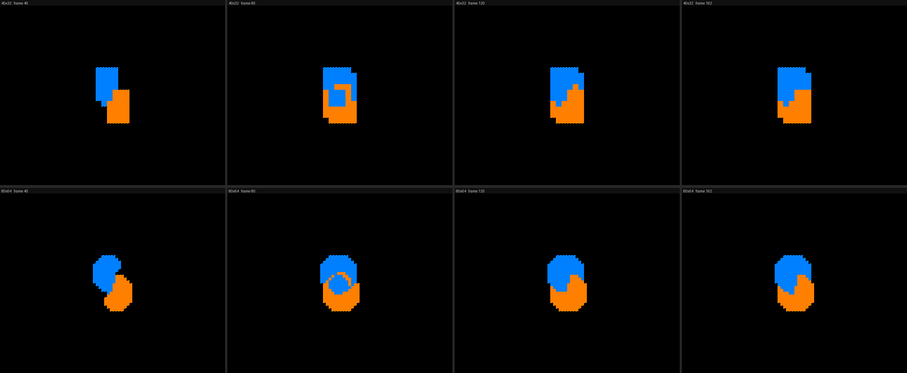
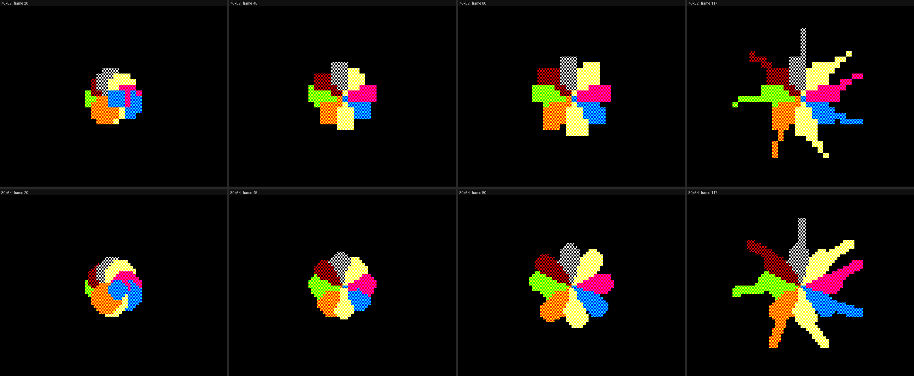
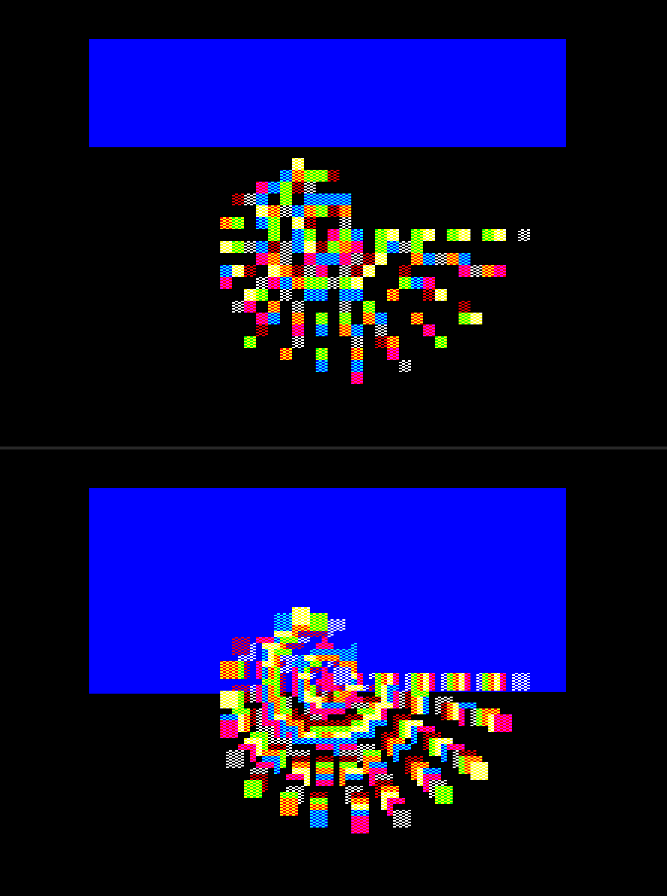

# Rose Nano v1 — report

2026-07-28, overnight session. Branch `rose-nano`.

**Rose Nano runs on a stock BBC Model B.** A compiler, a runtime and a
verification harness exist; six example programs build, boot in jsbeeb, draw,
and match a Python reference model **byte-for-byte across all 20,480 bytes of
screen RAM**. All six feasibility experiments are now run; two of them changed
the design. The engine since moved to an **80×64 grid** (§6), which the
addressing turned out to support for free.



*`bloom.nano`, screenshot straight out of jsbeeb. Eight colours; the oranges,
pinks, creams and greys are 50/50 dither pairs.*

---

## 1. What to look at first

| | |
|---|---|
| The picture | `bbc/docs/mockups/nano-v1-bloom-beeb.png` — real emulator output |
| Growth over time | `bbc/docs/mockups/nano-v1-bloom-sheet.png` — frames 20/60/120/300 |
| The language | `bbc/nano/examples/bloom.nano` (38 lines, does all of the above) |
| Build and run | `sh bbc/nano/build.sh bloom 600 && node bbc/nano/run.mjs bloom 600` |
| Verify | `python bbc/nano/nanoref.py examples/bloom.nano 600 --check build/bloom.screen.bin` |
| Verify everything | `sh bbc/nano/verify.sh` — all six examples × both grids (§7) |
| Preview without a build | `python bbc/nano/nanoref.py examples/bloom.nano --sheet 20,60,120,300 out.png` |
| The old grid | prefix any of the above with `NANOGRID=40x32` (§6) |

Docs updated in place: `rose-nano.md` §13 (experiment 3), §14 (experiment 1),
and amendment boxes in §1, §2, §3, §4.1, §8, §9, §10, §12.

---

## 2. Experiments — all six now run

| # | Experiment | Verdict |
|---|---|---|
| 1 | MODE 2 layout + stamp cost | **Passed the assumption, failed the estimate** — `rose-nano.md` §14 |
| 2 | RAM budget | **Passed with room to spare** — below |
| 3 | Grid render — does it look like Rose? | **Passed, and refuted §3's fixed size** — `rose-nano.md` §13 |
| 4 | Dither-pair survey | **27 usable colours, not 36 and not 8** — below |
| 5 | Palette cycling | **Passed, and it is the best thing here** — below |
| 6 | Compiled vs interpreted turtle step | **Measured on the real engine** — §5 |

### Experiment 2 — RAM

Measured on the machine: MODE 2 on a Model B with DFS 1.2 gives `PAGE=&1900`,
`HIMEM=&3000` — **5,888 bytes** with DFS left alive, before any of §2's escape
valves.

What v1 actually occupies, from the build:

| program | engine + code + tables + turtle pool | free |
|---|---|---|
| `bloom` (3 procs, 8 tints) | 2,814 B | 3,074 B |
| `stress` (3 procs) | 2,566 B | 3,322 B |

That includes the 48-turtle pool (15 arrays × 48 = 720 B), a 128-entry move
table per distinct distance (512 B each), the row-base and span tables, and the
whole runtime.

**The doc's binding constraint turns out not to bind.** §2 called bytes "the
binding constraint… every design decision below should be read with 8.5KB in
mind", and warned that experiment 2 could kill the MODE 2 configuration
outright. In fact v1 uses **45% of the smaller 5,888-byte budget** and never
needs to reclaim DFS workspace, shrink the screen, or fall back to MODE 5. The
headroom is real: ~6 more move distances, or a 128-turtle pool, or the §7.4
shadow grid at 40×32 (1,280 B) all fit.

The reason is §5's arithmetic paying off — an 11-byte turtle against the port's
144 — plus the decision to compile rather than interpret, which puts the program
in code rather than in a bytecode array *and* a jump table.

### Experiment 4 — how many colours are actually there

All 36 fifty-fifty combinations of the eight physicals, mixed in linear light
and de-duplicated by weighted perceptual distance:

**27 distinct colours: 8 solids + 19 dithers.** The count is stable for any
threshold between 40 and 100, which is a strong signal — the set does not
degrade gracefully, it just is 27.

The nine that collapse are exactly the *opposite* pairs — red+green, red+blue,
yellow+blue, magenta+cyan and so on. That is a pleasing convergence: the pairs
that are numerically redundant are the same ones §13.4 found do not fuse at a
MODE 2 pixel. **There is no tension between "looks right" and "adds a colour".**

So §4.1's "roughly 90 apparent tints" was optimistic and §9's worry that Nano
might be "an 8-colour system" was pessimistic. It is a 27-colour system, for
zero cycles.
### Experiment 5 — palette cycling

Built into the engine and demonstrated. A `spin lo hi rate` declaration rotates
a range of logical colours every `rate` frames; the runtime rewrites eight
entries to the video ULA at &FE21, which costs about **50 cycles a frame**.

`cycle.nano` draws six arms once, over 26 frames, and then every turtle dies.
`palseq.mjs` then screenshots the machine at six later frames *and dumps screen
RAM at each one*:



```
frame 200: screen bytes identical to the first shot
frame 203: screen bytes identical to the first shot
frame 206: screen bytes identical to the first shot
frame 209: screen bytes identical to the first shot
frame 212: screen bytes identical to the first shot
frame 215: screen bytes identical to the first shot
```

**All 20,480 bytes are identical in every frame. Nothing is drawn. The picture
moves anyway.** The check is the point: it proves the motion is the palette and
not a redraw.

§4.2 claimed this was the most Nano-specific expressive idea in the design — the
only mechanism that adds on-screen motion for zero interpreter time, and the one
that composes with persistent trails so that a trail keeps moving after the
turtle that drew it is gone. That is exactly what the strip shows, and it works
because the dither patterns hold *logical* colour numbers, so remapping
logical→physical recolours everything already on screen.

Worth noting for composition: rotating a range that a dither pair straddles
gives a shimmer rather than a flat colour change, because the pair's two halves
move independently. `cycle.nano` uses solid tints to make the effect legible;
the shimmer is the more interesting case and is untried.


---

## 3. What was built

```
bbc/nano/
  nanoc.py       compiler: .nano -> 6502 (beebasm source)
  runtime.asm    scheduler, allocator, mover, stamper
  nanoref.py     reference model + verifier + preview renderer
  build.sh       nanoc -> beebasm -> bootable .ssd (SHIFT+BREAK runs it)
  verify.sh      every example x every grid, byte-checked against nanoref
  run.mjs        boot in jsbeeb, dump screen RAM, screenshot
  profile.mjs    frame cost under load (experiment 6)
  palseq.mjs     palette-cycle frame strip + screen-RAM check (experiment 5)
  examples/      bloom, rain, spiral, cycle, stress, stress0
```

### The raster debug build

`RASTER=1 sh bbc/nano/build.sh <name>` recolours logical 0 to blue for the
duration of the turtle pass and back to black at the end of it. Two writes to
the video ULA, 8 cycles a frame, no screen bytes touched — so a raster build
still verifies against the reference model. The blue band is then a direct
picture of how far down the frame the scheduler got, with the ragged right
edge giving the cycle position within the line.



That is `stress0` at 40×32 — 48 live turtles, 1-cell blobs — using about a fifth
of the frame. When it was taken, the band was also the quickest way to see that
the picture examples were nowhere near the limit: `bloom`, `rain` and `spiral`
all completed inside vertical blanking and showed no band at all. §6 spends that
slack, and the same instrument is what showed it going.

### The language

Rose's shape, kept deliberately: `plan` for the palette, `proc` with parameters,
first proc is the entry, `~` for negation, four-letter keywords, and the Rose
recursion idiom — `fork self n-1` then fall off the end and die — as the only
loop.

```
proc walk n
    draw
    move 3
    turn rand 8
    turn ~4
    wait 1
    when n > 0
        fork walk n-1
    done
```

Statements: `jump face tint size move turn draw wait fork when/else/done`, plus
the `plan` and `spin` declarations. Comments are `#` and comparisons are
`==`/`!=`, spelled as Rose spells them — §7 closed that gap, and closed it far
enough that four of the six examples now parse in the Rose visualizer verbatim.
Expressions are deliberately the smallest grammar that expresses that idiom:
constant, local, `local±constant`, and `rand N`. No division, **no multiply
either** — `move` is two table lookups and two 16-bit adds (§5.2).

### The engine

- **Compiled, not interpreted** (§6.4). Each proc is straight-line 6502 with
  turtle state in structure-of-arrays indexed by X (`lda tdir,x`), and `wait`
  saves PC and jumps to the scheduler, which resumes with `jmp (PCV)`. Zero
  dispatch.
- **48-turtle pool**, 11 bytes each, allocator scanning from slot 0, turtles
  dying at the end of a proc.
- **The renderer is the point.** Experiment 1 established that a 40×32 grid cell
  is 4px × 8 rows = **16 contiguous bytes**. So painting a cell is one unrolled
  run of stores — no mask, no read-modify-write, no per-line setup — and
  stepping to the next cell is a constant add. Blob size is a table of cell
  radii; clipping is two comparisons on small integers. (§6 generalises this to
  80×64, where a cell is 4 bytes; the engine is now written against the grid
  rather than against one grid.)
- **Dither locked to screen position for free**: within a cell, byte index
  parity *is* scanline parity, so alternating two pattern bytes gives a
  checkerboard that tiles seamlessly between overlapping blobs (§13.4's
  requirement, at no cost).
- **The canvas is a torus.** The grid rows divide 256 exactly, so y wraps for
  free; x wraps with three instructions. `rain.nano` exists to demonstrate it.

---

## 4. Verification — and it earned itself immediately

`nanoref.py` re-implements the semantics in Python and renders to a
20,480-byte MODE 2 buffer, compared byte-for-byte with screen RAM dumped out of
jsbeeb. It mirrors the runtime deliberately, including the parts that are not
obviously right — 128-direction tables, toroidal wrap, allocation scanning from
slot 0 — because the point is to catch divergence, not to be elegant.

```
bloom:   screen matches the model exactly (20480 bytes)
rain:    screen matches the model exactly (20480 bytes)
spiral:  screen matches the model exactly (20480 bytes)
cycle:   screen matches the model exactly (20480 bytes)
stress:  screen matches the model exactly (20480 bytes)
stress0: screen matches the model exactly (20480 bytes)
```

All six pass at **both** grids — twelve checks, 20,480 bytes each — so
`NANOGRID` is verified rather than merely retained.

The last two were added while doing §6, and getting them in took a harness fix
worth recording. `run.mjs` ran `frames × 40,000` cycles and then *assumed* the
engine had completed that many frames. For the four picture examples it has,
because they finish and the screen goes static. The two stress benchmarks never
finish, so the dump landed mid-scheduler-pass and the comparison failed — by 36
bytes at 80×64 and 64 bytes at 40×32, which is exactly one blob in each case.
Not a divergence: a photograph taken while the subject was moving. Building with
`MAXFRAMES` so the engine halts on a frame boundary makes both verify exactly.
`run.mjs` now reads the real frame counter out of the machine and says so when
it differs from what was asked for, so the next instance of this announces
itself instead of looking like a bug in the engine.

**It found a real bug within an hour of existing.** The runtime indexed the
palette and span tables with unmasked `tint` and `size`; the model masked them.
No example exercised it until `rain` was changed to cycle its tints past 7 —
at which point it surfaced as a byte mismatch with an exact address, instead of
as mystery garbage on screen. That is precisely the argument §6 of the Micro
doc makes for the harness being non-negotiable, and it held.

A second, subtler catch: the "finished" flag was originally written to `&7FF0`,
which is *inside* screen RAM. The verifier reported exactly one differing byte.
It was also visible as a stray white dash in the corner of the first screenshot
— but the harness named it before I looked.

---

## 5. Experiment 6 — what a compiled turtle step costs

Measured on the finished engine (`profile.mjs`), not a synthetic benchmark:
built with vsync disabled so frames run back to back, run until the 48-slot pool
saturates, then sampled over long windows.

| blob size | live turtles | cycles/frame | % of a 50Hz frame |
|---|---|---|---|
| size 0 (1 cell) | 47 | **20,725** | 51.8% |
| size 1 (9 cells) | 47 | **50,955** | 127.4% |

Each turtle alternates between a drawing frame and a fork-and-die frame, so
~23 of the 47 draw in any given frame. From the two rows:

- **~164 cycles per extra grid cell** — which independently reproduces
  experiment 1's `8.79 cycles/byte` over a 16-byte cell plus ~20 of per-cell
  overhead. The engine and the microbenchmark agree.
- **~700 cycles for everything that is not the blob** — `move`, `turn`, the
  `when`, the fork, the scheduler pass and the coroutine yield, combined.

That last number is the answer to experiment 6, and it is the one I would put in
front of a sceptic: **Micro's measured cost for `move` alone is 686 cycles**
(§9.3), and the BBC port's is 1,456. A whole compiled Nano turtle step — move,
turn, compare, fork a child, yield, and be rescheduled — costs about what Micro
pays for one `move`. Removing dispatch and narrowing the word did what §6.4 said
they would.

**Practical envelope for 50Hz:** ~23 active turtle-steps per frame with 1-cell
blobs and ~45% of the frame still free; ~10 with 9-cell blobs. `stress.nano` at
47 live turtles and 9-cell blobs is a 25Hz demo, which is an honest number
rather than a disappointing one — it is deliberately the worst case.

---

## 6. The 80×64 grid

The 40×32 grid was chosen in experiment 1 because its cell is 16 contiguous
bytes. That is a real property worth having, but it turned out not to be scarce:
**80×64 keeps it.**

### Why it works

A cell is `(1<<XSH)` pixels wide — that is `(1<<XSH)/2` byte-columns, which sit
8 bytes apart — by `(1<<YSH)` scanlines. Its bytes are contiguous only if the
cell is *one byte-column wide*, or spans a *whole* 8-scanline character row.
80×64 satisfies the first clause: 2px × 4 scanlines is one byte-column, half a
character row, 4 contiguous bytes at

```
&3000 + (row>>1)*640 + col*8 + (row&1)*4
```

40×64 would satisfy neither and is not expressible. And since 80×64's cell is
also square — 2px is 4 units at MODE 2's 2:1 pixel aspect, against 4 scanlines —
it is the *finest square-cell grid whose cells stay contiguous*. Not a point on
a road, the end of it.

Two things then fall out for free. The addressing code does not change at all:
the runtime already went `RBASE = rowlo[row]` then `P = RBASE + colo[col]`, so
the `(row&1)*4` folds into the row table and `col*8` into the column table.
And the dither is untouched, because byte-index parity is still scanline parity
in both halves of a character row (offsets 0–3 → scanlines 0–3, 4–7 → 4–7).
Existing `plan` palettes carry over unchanged.

So the engine is now written against `GW, GH, XSH, YSH, CELLB, COLSTEP, NSIZE`,
which `nanoc.py` hands down, rather than against one geometry. `NANOGRID=40x32`
still builds the old grid — and does so *byte-identically to the pre-change
code* on all four picture examples, which is how I know the parameterisation
cost nothing.

### Rescaling the examples

Blob radii are in cells, so halving the cell halves the picture. The mapping is
`S = 2s+1`: the exact match would need diameter `4s+2` cells, which is even and
the span tables are odd-diameter only, so `2s` and `2s+1` bracket it.

`2s+1` is the right side to land on, and not because of size. At `2s` the
finest trail (`size 0` → 0) is 2px wide while `move 3` steps 3px, so
consecutive draws stop touching and the trail breaks into dots. Connectedness
is a property of the picture, not of its scale.

### What it looks like

`spiral` is the honest test, because at 40×32 you cannot actually tell it is a
spiral — it is two rectangles. (40×32 above, 80×64 below.)



`bloom` gains curvature in the petals rather than staircases:



### What it costs

Whole-program, vsync disabled, run to each example's own completion frame:

| | 40×32 | 80×64 | ratio | % of a 50Hz frame |
|---|---|---|---|---|
| `bloom` (117 frames) | 24,103 | **29,573** | 1.23× | 73.9% |
| `rain` (144 frames) | 15,694 | **18,611** | 1.19× | 46.5% |
| `spiral` (162 frames) | 12,840 | **13,827** | 1.08× | 34.6% |

And at steady state with the 48-slot pool saturated, where `stress` is the
matched-area pair (9 cells × 16 B = 288 px·scanlines against 37 × 4 = 296):

| | 40×32 | 80×64 | ratio |
|---|---|---|---|
| `stress` (size 1 → 3) | 50,000 | **71,429** | 1.43× |
| `stress0` (size 0 → 1) | 20,513 | **31,250** | 1.52× |

The `stress` row is the number to quote: **1.43× for the same physical blob**,
against 1.45× predicted from cycle-counting the loop beforehand. Stores are a
wash — 144 bytes against 148 — and the whole difference is per-cell overhead
paid 37 times instead of 9.

The picture examples come in far under that, at 1.08–1.23×, because their cost
is not all blob. Everything §5 measured as the ~700 cycles of `move`, `turn`,
`when`, fork and reschedule is per *turtle*, not per cell, and does not move
when the grid does.

Cost in memory is +171 bytes (`bloom` 2,643 → 2,814), against 3,074 free.

### What it costs in headroom

This is the part that changed my mind about the trade. Before, `bloom`, `rain`
and `spiral` all completed inside vertical blanking and showed no raster band at
all. They no longer do — `bloom` at its peak (24 live turtles, frame 12) now
uses about half the visible frame:



`stress0` at 40×32 above, 80×64 below. So 80×64 spends the slack that v1 had
lying around. Everything still fits — the worst picture example is at 74% — but
"finishes before the beam reaches the display" was a real property and it is
gone. Beam-racing the draw order (§7) stops being a curiosity and becomes the
thing that would buy it back.

---

## 7. Reading `.nano` in the Rose visualizer

Nano and Rose had drifted apart in spelling more than in substance. The
question was what it would take to open a `.nano` in `visualizer/rose.exe` and
watch it, so that authoring does not require a build-and-boot cycle. The answer
turned out to be: very little, and most of the gap was gratuitous.

Running the six examples through `rose.exe` found exactly five blockers, and
three of them were Nano spelling Rose's own ideas differently for no reason:

| Blocker | Resolution |
|---|---|
| `;` comments | **Fixed** — Nano now uses `#`, as Rose does |
| `=` / `<>` | **Fixed** — now `==` / `!=`, as Rose does |
| `back RGB` | **Removed** — see below |
| `rand N` | Kept. Rose's `rand` is nullary and returns 16.16 in 0..1 |
| no `form` | Kept. Nano's canvas is fixed at 160×256; Rose needs it declared |

`back` is the interesting one. Every example set it to the same value as plan
entry 0 — and *had* to, because `clearbg` fills the screen with it while §13.4
requires a background-tinted blob to be invisible. It was a second way to say
one thing, which is only ever a way to disagree with yourself. The background is
now plan entry 0 by definition, and `back` raises an error pointing at the plan.

What needed no translation at all is the more encouraging half: Rose's `color`
token is `digit+ ':' hexdigit hexdigit hexdigit`, so a whole Nano `plan` block
lexes as Rose unchanged. So do `proc` and its parameters, `fork p args`,
`when`/`else`/`done`, `~` negation, `n-1`, the four-letter keyword rule, and
directions at 256 units to the circle.

With those changes, **four of the six examples parse in the Rose visualizer
verbatim** — `rain`, `spiral`, `stress`, `stress0` — needing only a `form`
line prepended. `bloom` still needs `rand 8` → `rand * 8`; `cycle` still uses
`spin`, deliberately (below).

### What is deliberately not aligned

`spin` stays a Nano declaration. Rose has no concept to map it onto: Rose's
colour model is layers, Nano's is an eight-entry video ULA palette, and the
whole point of §2's experiment 5 is rotating that palette in place. Spelling it
in Rose syntax would buy a parse and no picture.

More importantly, four divergences **survive parsing** and would make a naive
preview lie:

- **Tint wraps.** Nano masks `AND #7` in `tdraw`. Rose treats tint as a layer
  index and warns. `rain` and `stress` both walk tint past 7 — they are relying
  on the wrap.
- **The pool is finite.** Nano has 48 slots and silently drops a `fork` when
  full. The visualizer ran `stress` to **87 turtles alive**, i.e. it rendered a
  program the BBC cannot run.
- **`size` means different things.** Nano's is a blob index 0–7 selecting a cell
  radius; Rose's is a circle radius in pixels.
- **Pixels are not square.** Nano halves dx in its move tables because MODE 2
  pixels are 2:1. The visualizer's `x<scale>` is uniform, so a Nano circle
  previews as an ellipse.

This is why the next step is a *render mode* in the visualizer — 160×256 at 2:1
pixel aspect, tint masked to 3 bits, a 48-turtle cap, blobs snapped to the grid
— rather than a `.nano`→`.rose` converter. A converter that hid those four
things would produce a preview that disagrees with the machine, and not
disagreeing with the machine is the whole thesis of §4.

### `verify.sh`

The twelve-check sweep that §6 ran by hand is now `bbc/nano/verify.sh`, which
builds, runs and compares every example at every grid. It exists because this
section changed the parser, and a language change that cannot be cheaply
re-verified is a language change nobody will make. All twelve still match.

It also fixed a false alarm: `run.mjs` reported "over budget" whenever the
engine finished fewer frames than the cycle budget bought — which is *always*
true for a `MAXFRAMES` build, since halting early is the point. It now only
warns when the engine did not halt.

---

## 8. What changed in the design tonight

Two things, both from measurement:

**The fusion penalty does not transfer.** §13.4 calibrated `fuse = 0.25` against
a chooser with eight dither levels, where the penalty was scaled by the minority
fraction — so a 1:7 dither was penalised an eighth as hard as a 1:1 one. v1 has
only 50/50 mixes, where that scaling is always 1.0, and 0.25 collapses *every*
colour to a solid. Recalibrated to **0.02**, at which point 880 → black+yellow,
08F → blue+cyan, F80 → red+yellow, exactly as §13.4 wanted. The first `bloom`
build was eight flat colours; the second is the picture at the top.

**RAM is not the binding constraint** (§2, above). Worth propagating into the
doc's framing, which currently leads with it.

---

## 9. Where I stopped, and what I would do next

Not done, in the order I would pick them up:

1. **Compose with the cycling shimmer.** §6's palette rotation works on solid
   tints; rotating a range that a *dither pair* straddles should shimmer rather
   than switch, and nothing has tried it. Cheapest interesting experiment left.
2. **Beam-race the draw order.** v1 draws turtles in slot order, not raster
   order, so a heavy frame can tear. §6.3's counting sort into row buckets (64
   of them now) is cheap and would remove it. This moved up the list with the
   80×64 grid: §6 spent the vertical-blanking slack the pictures used to have,
   so drawing ahead of the beam is now worth real frames rather than tidiness.
3. **Better examples.** `bloom` is a genuine picture; `rain` and `spiral` are
   mechanism demos. The language is now expressive enough to compose properly,
   and I would rather you did that than me.
4. **Language gaps** worth closing: `move` with a computed distance (currently
   compile-time constants only, because each one costs a 512-byte table),
   expressions richer than `local±constant`, and turtle `life`/eviction (§6.2)
   — v1 turtles die by falling off the end of a proc, and a full pool silently
   drops forks.
5. **The §7 multipliers** — hardware scroll, symmetry, herds, the shadow grid —
   all still deferred, all still cheap, and RAM for the shadow grid now
   demonstrably exists.

### Honest limitations of v1

- Blob sizes 0–7 are compiled at 80×64 but only 1, 3 and 5 are exercised by the
  examples, which reached those by the `S = 2s+1` rescale rather than by design.
- `spin` rotates one contiguous range at one rate; there is no per-tint control.
- A full turtle pool drops forks silently; there is no eviction policy.
- No sound, no `plan` animation, no `part`/include, no `temp` locals beyond proc
  parameters (4 per turtle).
- The over-budget `stress` case is a real ceiling, not a tuning artefact: a
  full pool of mid-sized blobs is simply more than 40,000 cycles buys. It was
  127% of a frame at 40×32 and is 179% at 80×64.
- `spiral.nano` draws a small tight circle — correct, but it is the least
  interesting of the three.

---

## 10. Bottom line

The question the doc has been circling since it was written is whether
designing *for* the BBC rather than squeezing Rose onto it actually buys
anything. Tonight it stopped being a document and started being a machine, and
the answer is yes, with numbers attached:

- palette cycling that moves a finished picture with **byte-identical screen
  memory**, for ~50 cycles a frame;
- an engine and a program in **2.6KB**, on a machine the port needed a Master,
  a coprocessor and sideways-RAM paging to satisfy;
- a compiled turtle step costing about what Micro's `move` costs on its own;
- **27 colours** on an eight-colour display for zero cycles;
- and a verification harness that is byte-exact on the first three programs and
  has already caught two bugs.

What it is not yet is a body of work. The instrument is built and in tune; the
music is the next thing, and that part is yours.
